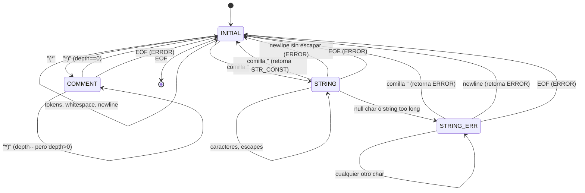

# 📚 Explicación Detallada del Lexer COOL — Guía de Sustentación

## Índice
1. [¿Qué es un Lexer (Analizador Léxico)?](#1-qué-es-un-lexer)
2. [¿Qué es Flex y cómo funciona?](#2-qué-es-flex)
3. [Estructura del archivo cool.flex](#3-estructura-del-archivo)
4. [Sección de Definiciones (líneas 1–48)](#4-sección-de-definiciones)
5. [Condiciones de Inicio / Máquina de Estados (líneas 50–55)](#5-condiciones-de-inicio)
6. [Expresiones Regulares (líneas 57–88)](#6-expresiones-regulares)
7. [Reglas en INITIAL (líneas 90–197)](#7-reglas-initial)
8. [Reglas en COMMENT (líneas 199–223)](#8-reglas-comment)
9. [Reglas en STRING (líneas 225–339)](#9-reglas-string)
10. [Reglas en STRING_ERR (líneas 341–370)](#10-reglas-string_err)
11. [Diagrama de la Máquina de Estados](#11-diagrama-máquina-de-estados)
12. [Banco de Preguntas para la Sustentación](#12-banco-de-preguntas)

---

## 1. ¿Qué es un Lexer?

Un **lexer** (analizador léxico o scanner) es la **primera fase** de un compilador. Su trabajo es:

```
Código fuente (texto) → Secuencia de tokens
```

**Ejemplo:** El texto `x <- 42 + y;` se convierte en:
| Token | Tipo | Valor |
|-------|------|-------|
| `x` | OBJECTID | "x" |
| `<-` | ASSIGN | — |
| `42` | INT_CONST | "42" |
| `+` | '+' (ASCII 43) | — |
| `y` | OBJECTID | "y" |
| `;` | ';' (ASCII 59) | — |

El lexer **NO** entiende la estructura del programa (eso lo hace el parser). Solo divide el texto en unidades significativas.

### ¿Qué hace con los espacios y comentarios?
Los **descarta** (no genera tokens para ellos). Son "whitespace" desde el punto de vista del compilador.

### ¿Qué pasa con los errores?
Si encuentra algo que no reconoce (por ejemplo, el carácter `#`), genera un token especial `ERROR` con un mensaje descriptivo.

---

## 2. ¿Qué es Flex?

**Flex** (Fast Lexical Analyzer Generator) es una herramienta que **genera** código C/C++ para un lexer a partir de un archivo de especificación (`.flex` o `.l`).

### Flujo de trabajo:
```
cool.flex  →  [flex]  →  cool-lex.cc  →  [g++]  →  lexer (ejecutable)
```

1. Tú escribes las **reglas** en `cool.flex` (expresiones regulares + acciones en C)
2. Flex genera `cool-lex.cc` (un autómata finito determinista en C++)
3. g++ compila eso junto con otros archivos → ejecutable `lexer`

### ¿Cómo funciona internamente Flex?
Flex construye un **autómata finito determinista (DFA)** a partir de las expresiones regulares. Cuando lee caracteres del input:
1. El DFA va transitando estados según cada carácter leído
2. Busca el **match más largo posible** (longest match rule)
3. Si hay empate en longitud, usa la **primera regla** del archivo (priority rule)
4. Cuando encuentra un match, ejecuta la **acción** (código C entre `{ }`)

---

## 3. Estructura del archivo cool.flex

Un archivo Flex tiene **3 secciones** separadas por `%%`:

```
DEFINICIONES
%%
REGLAS
%%
CÓDIGO DE USUARIO (opcional, vacío en nuestro caso)
```

### Sección 1: Definiciones (líneas 1–48)
- Código C entre `%{` y `%}` (includes, variables globales)
- Start conditions (`%x`)
- Macros de expresiones regulares (`DARROW`, `CLASS`, etc.)

### Sección 2: Reglas (líneas 90–370)
- Patrones (expresiones regulares) seguidos de acciones (código C)
- Agrupados por condiciones de inicio (`<INITIAL>`, `<COMMENT>`, `<STRING>`, `<STRING_ERR>`)

### Sección 3: Código adicional (vacía)
- Después del segundo `%%` (no la usamos)

---

## 4. Sección de Definiciones (líneas 1–48)

### Includes (líneas 11–14)
```cpp
#include <cool-parse.h>   // Tokens del parser (CLASS, IF, ERROR, etc.)
#include <stringtab.h>    // Tablas de símbolos (stringtable, idtable, inttable)
#include <utilities.h>    // Funciones auxiliares del framework
```

> [!IMPORTANT]
> `cool-parse.h` define todos los tokens como constantes enteras (`#define CLASS 258`, `#define IF 259`, etc.). Es generado por el parser (bison). Sin este archivo, el lexer no sabría qué número entero retornar para cada token.

### Macros obligatorias (líneas 17–18)
```cpp
#define yylval cool_yylval  // Renombra la variable de valor semántico
#define yylex  cool_yylex   // Renombra la función del lexer
```
Esto es necesario porque el framework de Stanford usa prefijos `cool_` para evitar conflictos de nombres.

### MAX_STR_CONST (línea 21)
```cpp
#define MAX_STR_CONST 1025  // 1024 caracteres + '\0' terminador
```
COOL permite strings de hasta **1024 caracteres**. Si un string es más largo, debe generar error `"String constant too long"`.

### YY_INPUT (líneas 29–32)
```cpp
#undef YY_INPUT
#define YY_INPUT(buf,result,max_size) \
    if ( (result = fread((char*)buf, sizeof(char), max_size, fin)) < 0) \
        YY_FATAL_ERROR("read() in flex scanner failed");
```
Redefine **cómo Flex lee la entrada**. En vez de leer de `stdin`, lee del archivo `fin` (que es configurado por `main()` en `lextest.cc`).

### Variables globales (líneas 34–46)
```cpp
char string_buf[MAX_STR_CONST];  // Buffer donde se construye el string carácter por carácter
char *string_buf_ptr;            // Puntero que avanza dentro de string_buf

extern int curr_lineno;          // Número de línea actual (para mensajes de error)
extern int verbose_flag;         // Si está activo, imprime más info de debug

extern YYSTYPE cool_yylval;      // Unión que contiene el valor semántico del token
```

### Variables estáticas propias (líneas 45–46)
```cpp
static int comment_depth = 0;             // Contador de anidamiento de comentarios
static const char *string_err_msg = NULL; // Almacena el mensaje de error durante STRING_ERR
```

> [!NOTE]
> `comment_depth` es un **contador** (no un booleano) porque los comentarios `(* ... *)` de COOL pueden estar **anidados**: `(* outer (* inner *) outer *)`. Cada `(*` incrementa, cada `*)` decrementa. Solo se vuelve a INITIAL cuando llega a 0.

---

## 5. Condiciones de Inicio / Máquina de Estados (líneas 50–55)

```
%x COMMENT
%x STRING
%x STRING_ERR
```

La `%x` significa **condición exclusiva** (exclusive start condition). Cuando el lexer está en un estado exclusivo, **solo** se ejecutan las reglas que pertenecen a ese estado.

### Los 4 estados del lexer:

| Estado | Propósito | Cuándo entra | Cuándo sale |
|--------|-----------|-------------|-------------|
| `INITIAL` | Estado normal, reconoce tokens | Al iniciar o al salir de otro estado | Al encontrar `(*`, `"`, o EOF |
| `COMMENT` | Dentro de un comentario `(* ... *)` | Al leer `(*` | Al leer `*)` con `comment_depth == 0`, o EOF |
| `STRING` | Dentro de una cadena `"..."` | Al leer `"` en INITIAL | Al leer `"`, `\n` no escapado, error, o EOF |
| `STRING_ERR` | Recuperación tras error en string | Cuando ocurre un error dentro de STRING | Al encontrar `"`, `\n`, o EOF |

### ¿Por qué usamos `%x` (exclusiva) y no `%s` (inclusiva)?
Con `%s` (inclusiva), las reglas **sin estado** también se activarían. Eso sería catastrófico: dentro de un string, el lexer intentaría reconocer palabras clave, operadores, etc. Con `%x`, solo las reglas específicamente marcadas para ese estado aplican.

### ¿Para qué sirve STRING_ERR?
Es un **estado de recuperación de errores**. Cuando se detecta un error dentro de un string (null character, string demasiado largo), NO podemos simplemente retornar ERROR de inmediato porque **debemos consumir el resto del string** hasta la comilla de cierre o el salto de línea. Si no hiciéramos esto, el lexer intentaría interpretar el contenido restante del string como tokens normales, generando errores espúreos en cascada.

**Ejemplo:**
```
"hello\0world"  
```
Sin STRING_ERR: Error en `\0`, luego `world` sería un OBJECTID, luego `"` sería un string vacío.
Con STRING_ERR: Error en `\0`, consume `world"`, retorna un solo ERROR.

---

## 6. Expresiones Regulares (líneas 57–88)

### Operadores multi-carácter (líneas 60–62)
```
DARROW   =>      (flecha de case: match => expr)
ASSIGN   <-      (asignación: x <- 42)
LE       <=      (menor o igual)
```

### Palabras clave case-insensitive (líneas 65–81)
```
CLASS   [cC][lL][aA][sS][sS]
```
Cada carácter tiene dos alternativas `[xX]` para aceptar mayúsculas y minúsculas. Esto es porque en COOL, **las palabras clave no distinguen mayúsculas/minúsculas**: `class`, `CLASS`, `ClAsS` son lo mismo.

> [!IMPORTANT]
> Excepciones: `true` y `false` **deben empezar con minúscula** (`t` o `f`), pero el resto puede ser cualquier combinación: `tRuE`, `fAlSe` son válidos. Por eso no se definen como macros aquí, sino como reglas especiales en la sección de reglas (líneas 158–165).

### Identificadores y constantes (líneas 84–88)
```
DIGIT       [0-9]
INT_CONST   {DIGIT}+           → Uno o más dígitos: 0, 42, 12345
TYPEID      [A-Z][a-zA-Z0-9_]* → Empieza con Mayúscula: Int, Bool, Main, MyClass
OBJECTID    [a-z][a-zA-Z0-9_]* → Empieza con minúscula: x, foo, my_var
WHITESPACE  [ \t\r\f\v]+       → Espacios, tabs, retorno de carro, form feed, tab vertical
```

> [!NOTE]
> La distinción entre TYPEID y OBJECTID es fundamental en COOL: los tipos siempre empiezan con mayúscula y las variables/métodos siempre con minúscula. Esto permite al lexer distinguirlos sin contexto.

---

## 7. Reglas en INITIAL (líneas 90–197)

Este es el estado "normal" donde el lexer reconoce todos los tokens del lenguaje.

### 7.1 Comentarios de una línea (línea 97)
```flex
"--"[^\n]*   { /* Se ignora */ }
```
- `"--"` → Literalmente los caracteres `--`
- `[^\n]*` → Cero o más caracteres que NO sean salto de línea
- No hace nada (descarta el comentario)
- El `\n` al final **NO** es consumido, será procesado por la regla de `\n` (línea 112)

### 7.2 Inicio de comentario anidado (líneas 100–103)
```flex
"(*"  {
    comment_depth = 1;
    BEGIN(COMMENT);
}
```
- Establece la profundidad a 1
- Cambia al estado `COMMENT`

### 7.3 Cierre de comentario sin apertura (líneas 106–109)
```flex
"*)"  {
    cool_yylval.error_msg = (char*)"Unmatched *)";
    return (ERROR);
}
```
Si encontramos `*)` estando en INITIAL, es un error: no hay `(*` previo sin cerrar.

### 7.4 Operadores de un carácter (líneas 121–136)
```flex
"+"  { return '+'; }
"-"  { return '-'; }
...
```
Retornan directamente el **valor ASCII** del carácter. Esto es una convención del framework: los operadores de un solo carácter usan su código ASCII como identificador de token.

### 7.5 Palabras clave (líneas 139–155)
```flex
{CLASS}  { return (CLASS); }
{ELSE}   { return (ELSE); }
...
```
Cada macro se expande a la regex case-insensitive. `CLASS` es un `#define` de `cool-parse.h` con un valor entero.

### 7.6 Booleanos: true y false (líneas 158–165)
```flex
t[rR][uU][eE]    { cool_yylval.boolean = true;  return (BOOL_CONST); }
f[aA][lL][sS][eE] { cool_yylval.boolean = false; return (BOOL_CONST); }
```

> [!IMPORTANT]
> ¿Por qué la primera letra (`t` / `f`) es **solo minúscula** y no `[tT]` / `[fF]`?
> 
> Porque la especificación de COOL dice: "The first letter of `true` and `false` must be lowercase; the trailing letters may be upper or lower case." Si escribieras `True`, sería un **TYPEID**, no un booleano.

### 7.7 Constantes enteras (líneas 168–171)
```flex
{INT_CONST}  {
    cool_yylval.symbol = inttable.add_string(yytext);
    return (INT_CONST);
}
```
- `yytext` contiene el texto del match (ej: `"42"`)
- `inttable.add_string()` agrega el string a la **tabla de enteros** (una tabla hash que evita duplicados)
- Retorna un **símbolo** (puntero a la entrada en la tabla)

### 7.8 Identificadores (líneas 174–183)
```flex
{TYPEID}   { cool_yylval.symbol = idtable.add_string(yytext); return (TYPEID); }
{OBJECTID} { cool_yylval.symbol = idtable.add_string(yytext); return (OBJECTID); }
```
Ambos usan `idtable` (tabla de identificadores). La diferencia es solo el token retornado.

> [!NOTE]
> ¿Cómo distingue Flex entre `TYPEID` y una palabra clave como `CLASS`? Por la **regla de prioridad**: las palabras clave están **antes** en el archivo, así que si el texto es `"class"`, primero coincide con `{CLASS}` (por prioridad), no con `{OBJECTID}`. Si el texto fuera `"classify"`, no coincide con `{CLASS}` (que exige exactamente 5 letras), pero sí con `{OBJECTID}`.

### 7.9 Inicio de string (líneas 186–190)
```flex
\"  {
    string_buf_ptr = string_buf;  // Reiniciar el buffer
    string_err_msg = NULL;        // Limpiar errores previos
    BEGIN(STRING);                // Cambiar al estado STRING
}
```

### 7.10 Carácter inválido (líneas 193–196)
```flex
.  {
    cool_yylval.error_msg = yytext;
    return (ERROR);
}
```
El `.` (punto) coincide con **cualquier carácter excepto `\n`**. Es la regla "catch-all": si ninguna otra regla coincidió, el carácter es inválido en COOL (ej: `#`, `$`, `%`).

---

## 8. Reglas en COMMENT (líneas 199–223)

### 8.1 Anidamiento (líneas 203–212)
```flex
"(*"  { comment_depth++; }

"*)"  {
    comment_depth--;
    if (comment_depth == 0) {
        BEGIN(INITIAL);
    }
}
```

**Ejemplo de anidamiento:**
```
(* nivel 1 (* nivel 2 *) todavía nivel 1 *)
```
- `(*` → depth=1, entra a COMMENT
- `(*` → depth=2
- `*)` → depth=1 (no sale de COMMENT porque depth > 0)
- `*)` → depth=0 → `BEGIN(INITIAL)` (vuelve al estado normal)

### 8.2 Otros caracteres (líneas 214–216)
```flex
\n  { curr_lineno++; }      // Contar líneas dentro de comentarios
.   { /* Consumir */ }      // Ignorar todo lo demás
```

### 8.3 EOF en comentario (líneas 218–222)
```flex
<<EOF>>  {
    BEGIN(INITIAL);
    cool_yylval.error_msg = (char*)"EOF in comment";
    return (ERROR);
}
```
Si el archivo termina y todavía estamos dentro de un comentario, es un error. **Importante**: hacemos `BEGIN(INITIAL)` antes de retornar para que Flex no quede en un loop infinito de EOF.

---

## 9. Reglas en STRING (líneas 225–339)

Este es el estado más complejo. Construye el string carácter por carácter en `string_buf`.

### 9.1 Cierre normal (líneas 230–235)
```flex
\"  {
    BEGIN(INITIAL);
    *string_buf_ptr = '\0';                              // Terminador nulo
    cool_yylval.symbol = stringtable.add_string(string_buf);
    return (STR_CONST);
}
```
Cuando encuentra la comilla de cierre, termina el string con `\0`, lo agrega a `stringtable` y retorna el token.

### 9.2 Carácter nulo dentro del string (líneas 238–245)
```flex
\0     { string_err_msg = "String contains null character"; BEGIN(STRING_ERR); }
\\\0   { string_err_msg = "String contains null character"; BEGIN(STRING_ERR); }
```
- `\0` → Un byte nulo literal (0x00) dentro del string
- `\\\0` → La secuencia `\` seguida de un byte nulo

Ambos son errores. Se guarda el mensaje y se pasa al estado de recuperación `STRING_ERR`.

> [!NOTE]
> ¿Por qué no retornamos ERROR inmediatamente? Porque primero debemos **consumir el resto del string** hasta encontrar `"` o `\n`. Si retornáramos aquí, los caracteres restantes se interpretarían como tokens normales.

### 9.3 Newline no escapado (líneas 248–253)
```flex
\n  {
    curr_lineno++;
    BEGIN(INITIAL);
    cool_yylval.error_msg = (char*)"Unterminated string constant";
    return (ERROR);
}
```
Un salto de línea **sin escapar** dentro de un string es un error. El string queda sin terminar. Aquí sí retornamos ERROR directamente porque el `\n` ya actúa como "cierre" del string malformado.

### 9.4 Secuencias de escape especiales (líneas 256–300)
```flex
\\b  { *string_buf_ptr++ = '\b'; }  // Backspace (0x08)
\\t  { *string_buf_ptr++ = '\t'; }  // Tab (0x09)
\\n  { *string_buf_ptr++ = '\n'; }  // Newline (0x0A)
\\f  { *string_buf_ptr++ = '\f'; }  // Form feed (0x0C)
\\0  { *string_buf_ptr++ = '0';  }  // El DÍGITO cero, NO byte nulo
```

> [!IMPORTANT]
> `\\0` (backslash + dígito cero) **NO** es un byte nulo. Se convierte en el carácter `'0'` (ASCII 48). Esto es diferente del byte nulo literal `\0` (ASCII 0).

Cada una verifica primero si el buffer ya está lleno:
```cpp
if (string_buf_ptr - string_buf >= MAX_STR_CONST - 1) {
    string_err_msg = "String constant too long";
    BEGIN(STRING_ERR);
} else {
    *string_buf_ptr++ = '\t';  // (o el carácter correspondiente)
}
```

### 9.5 Newline escapado (líneas 303–311)
```flex
\\\n  {
    curr_lineno++;
    // ...
    *string_buf_ptr++ = '\n';
}
```
Un `\` seguido de un salto de línea real permite **dividir un string en varias líneas**:
```cool
"Hello \
World"
```
Se convierte en `"Hello \nWorld"`. Incrementa `curr_lineno` porque la línea física cambió.

### 9.6 Escape genérico (líneas 314–321)
```flex
\\.  {
    // ...
    *string_buf_ptr++ = yytext[1];
}
```
**Cualquier otro carácter** precedido de `\` se convierte en sí mismo: `\a` → `a`, `\q` → `q`, `\\` → `\`.

> [!NOTE]
> `yytext[1]` toma el **segundo carácter** del match (el que está después del `\`). `yytext[0]` sería el `\` mismo.

### 9.7 Orden de las reglas de escape (¡CRÍTICO!)

El orden importa por la **regla de prioridad** de Flex:

1. `\0` (byte nulo literal) — **MÁS ESPECÍFICO**, se evalúa primero
2. `\\\0` (backslash + byte nulo) — específico  
3. `\\b`, `\\t`, `\\n`, `\\f`, `\\0` — secuencias de escape con letras
4. `\\\n` — backslash + newline real
5. `\\.` — **catch-all** para cualquier otro escape

Si `\\.` estuviera ANTES de `\\n`, nunca se ejecutaría la regla de `\\n` porque `\\.` coincide con cualquier `\X`. Flex resuelve esto por **longest match** primero y **prioridad** después.

### 9.8 EOF en string (líneas 324–328)
```flex
<<EOF>>  {
    BEGIN(INITIAL);
    cool_yylval.error_msg = (char*)"EOF in string constant";
    return (ERROR);
}
```

### 9.9 Carácter regular (líneas 331–338)
```flex
.  {
    // ...
    *string_buf_ptr++ = yytext[0];
}
```
Cualquier carácter que no sea `"`, `\n`, `\0`, ni un escape se agrega literalmente al buffer.

---

## 10. Reglas en STRING_ERR (líneas 341–370)

Este estado existe para **recuperarse de errores** sin generar errores falsos en cascada.

### Comportamiento:
1. Consume todos los caracteres del string
2. Cuando encuentra `"` o `\n` (fin del string), **retorna el ERROR** original
3. Respeta escapes (`\\"` no es fin de string, `\\\n` no es newline real)

```flex
\"     { BEGIN(INITIAL); cool_yylval.error_msg = (char*)string_err_msg; return (ERROR); }
\n     { curr_lineno++; BEGIN(INITIAL); cool_yylval.error_msg = (char*)string_err_msg; return (ERROR); }
\\\n   { curr_lineno++; }        // Newline escapado: consumir, no es fin
\\.    { /* Consumir escape */ }  // \" escapado: consumir, no es fin
<<EOF>> { BEGIN(INITIAL); cool_yylval.error_msg = (char*)"EOF in string constant"; return (ERROR); }
.      { /* Consumir todo */ }    // Cualquier otro carácter: ignorar
```

---

## 11. Diagrama de la Máquina de Estados



---

## 12. Banco de Preguntas para la Sustentación

### Pregunta 1: ¿Qué es `yytext` y `yylval`?
**`yytext`** es un puntero `char*` que apunta al texto que coincidió con la regla actual. Por ejemplo, si la regex `{INT_CONST}` coincidió con `"42"`, entonces `yytext` apunta a `"42"`.

**`yylval`** (renombrado a `cool_yylval`) es una **unión** (`YYSTYPE`) que contiene el **valor semántico** del token. Según el tipo de token, se llena un campo diferente:
- `cool_yylval.symbol` → para INT_CONST, TYPEID, OBJECTID, STR_CONST (un Symbol*)
- `cool_yylval.boolean` → para BOOL_CONST (true/false)
- `cool_yylval.error_msg` → para ERROR (un char*)

### Pregunta 2: ¿Por qué los comentarios anidados necesitan un contador y no una simple flag?
Porque COOL permite anidar comentarios: `(* outer (* inner *) still in outer *)`. Con un booleano, al encontrar el primer `*)` saldrías del comentario prematuramente. Con un contador, solo sales cuando `depth == 0`.

### Pregunta 3: ¿Qué es la regla de "longest match" de Flex?
Si varias reglas pueden coincidir, Flex elige la que produce el **match más largo**. Ejemplo: si el input es `"class_name"`, tanto `{CLASS}` (5 chars) como `{OBJECTID}` (10 chars) coinciden con los primeros caracteres, pero `{OBJECTID}` coincide con los 10 → gana OBJECTID.

### Pregunta 4: ¿Qué pasa si dos reglas coinciden con la misma longitud?
Gana la que aparece **primero** en el archivo. Por eso las palabras clave (`{CLASS}`, `{IF}`) están ANTES de `{TYPEID}` y `{OBJECTID}`: si el input es exactamente `"class"`, tanto `{CLASS}` como `{OBJECTID}` coinciden con 5 chars, pero `{CLASS}` gana por prioridad.

### Pregunta 5: ¿Por qué `true` y `false` no están en la lista de keywords?
Porque su primera letra **debe ser minúscula**, pero el resto es case-insensitive. Si los pusiéramos como `[tT][rR][uU][eE]`, aceptarían `True` y `TRUE`, que en COOL serían TYPEID, no booleanos. Por eso las reglas son `t[rR][uU][eE]` y `f[aA][lL][sS][eE]` — primera letra fija en minúscula.

### Pregunta 6: ¿Por qué necesitas el estado STRING_ERR?
Para **recuperación de errores**. Cuando hay un error dentro de un string (null char, too long), no puedes retornar ERROR inmediatamente porque los caracteres restantes del string se interpretarían como tokens normales, generando errores falsos en cascada. STRING_ERR consume todo hasta `"` o `\n`, y recién entonces retorna el error.

### Pregunta 7: ¿Cuál es la diferencia entre `\0` y `\\0` en el estado STRING?
- `\0` → un **byte nulo literal** (ASCII 0x00) en el archivo fuente → ERROR
- `\\0` → el usuario escribió `\0` en su código COOL → se convierte en el carácter `'0'` (ASCII 0x30)

### Pregunta 8: ¿Cómo maneja el lexer un string que se extiende a múltiples líneas?
COOL permite dividir strings en líneas con un backslash antes del salto de línea:
```
"Hello \
World"
```
La regla `\\\n` (línea 303) captura esto: consume el `\` y el `\n`, incrementa `curr_lineno`, y agrega un `\n` al buffer del string.

Pero un `\n` **sin** `\` previo (línea 248) es un error: `"Unterminated string constant"`.

### Pregunta 9: ¿Qué hace `BEGIN(INITIAL)` antes del return en reglas de EOF?
Evita un **loop infinito**. Si Flex detecta EOF en un estado exclusivo y NO cambiamos de estado, volverá a detectar EOF, volverá a ejecutar la misma regla, etc. `BEGIN(INITIAL)` permite que el próximo EOF se maneje normalmente (terminando el lexer).

### Pregunta 10: ¿Qué son las tablas de símbolos (`stringtable`, `idtable`, `inttable`)?
Son **tablas hash** que almacenan strings únicos. Si el mismo identificador aparece 100 veces en el código, solo se almacena una vez en la tabla. `add_string()` retorna un puntero (`Symbol*`) a la entrada existente o la crea si no existe. Esto ahorra memoria y permite comparar identificadores por **puntero** en vez de por contenido.

### Pregunta 11: ¿Por qué `cool_yylval.error_msg = yytext` funciona para el carácter inválido (línea 194)?
Porque `yytext` apunta al buffer interno de Flex que contiene el carácter que matcheó. Como retornamos inmediatamente con `return (ERROR)`, el buffer no se modifica antes de que el caller lo use. Para strings más largos usamos copia explícita porque el buffer puede cambiar.

### Pregunta 12: ¿Qué pasa con el carácter `\` solo al final del archivo dentro de un string?
La regla `<<EOF>>` (línea 324) lo captura: `"EOF in string constant"`. El `\` queda sin par, pero EOF tiene prioridad sobre cualquier otra regla pendiente.

### Pregunta 13: ¿Qué hace `curr_lineno++`?
Lleva la cuenta del **número de línea actual** en el archivo fuente. Se incrementa cada vez que se encuentra un `\n` (en cualquier estado). Esto permite que los mensajes de error del compilador indiquen la línea correcta.

### Pregunta 14: ¿Por qué los operadores de un carácter retornan `return '+'` en vez de `return PLUS`?
Es una convención del framework de Stanford (y de muchos compiladores): los operadores de un solo carácter usan su **código ASCII** como identificador de token. Esto simplifica el parser porque puede usar `'+'` directamente en las gramáticas sin definir constantes adicionales.

### Pregunta 15: ¿Cuántos tokens diferentes puede generar el lexer?
- 21 palabras clave (CLASS, IF, ELSE, etc.)
- 16 operadores/delimitadores de un carácter (+, -, *, etc.)
- 3 operadores multi-carácter (DARROW `=>`, ASSIGN `<-`, LE `<=`)
- 4 constantes/identificadores (INT_CONST, STR_CONST, BOOL_CONST, TYPEID, OBJECTID)
- 1 token especial (ERROR)
- **Total: ~45 tipos de tokens diferentes**
