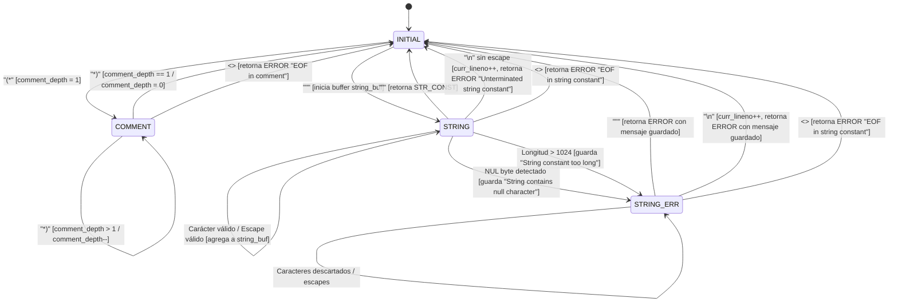

# Laboratorio 01 — Compiladores: Analizador Léxico para COOL (Cool Lexer)

> **Curso:** Compiladores  
> **Profesor:** Arles Rodríguez  
> **Referencia Académica:** Stanford University — CS143 (*Compilers*), Programming Assignment 2 (PA2 / PA2J).  
> **Puntuación Máxima de Calificación:** 63 / 63 puntos (`pa1-grading.pl`).  
> **Entregables Oficiales:** `cool.flex` (para C++) o `cool.lex` (para Java).  

---

## 📑 Tabla de Contenidos
1. [Contexto y Objetivos del Proyecto](#1-contexto-y-objetivos-del-proyecto)
2. [Estructura del Repositorio](#2-estructura-del-repositorio)
3. [Especificación Léxica de COOL](#3-especificación-léxica-de-cool)
   - [3.1 Conjunto de Tokens y Categorías Sintácticas](#31-conjunto-de-tokens-y-categorías-sintácticas)
   - [3.2 Identificadores y Palabras Clave](#32-identificadores-y-palabras-clave)
   - [3.3 Comentarios (Simples y Anidados)](#33-comentarios-simples-y-anidados)
   - [3.4 Cadenas de Texto (Strings) y Escapes](#34-cadenas-de-texto-strings-y-escapes)
   - [3.5 Manejo y Política de Errores](#35-manejo-y-política-de-errores)
4. [Diseño y Autómatas de Estados (DFA)](#4-diseño-y-autómatas-de-estados-dfa)
   - [4.1 Estados Léxicos](#41-estados-léxicos)
   - [4.2 Diagrama de Transición de Estados](#42-diagrama-de-transición-de-estados)
5. [Detalles de Implementación](#5-detalles-de-implementación)
   - [5.1 Versión C++ (`cool.flex`)](#51-versión-c-coolflex)
   - [5.2 Versión Java (`cool.lex`)](#52-versión-java-coollex)
6. [Guía de Compilación, Ejecución y Pruebas en la Máquina Virtual](#6-guía-de-compilación-ejecución-y-pruebas-en-la-máquina-virtual)
   - [6.1 Configuración de Entornos](#61-configuración-de-entornos)
   - [6.2 Compilación del Lexer](#62-compilación-del-lexer)
   - [6.3 Ejecución con Pruebas Manuales](#63-ejecución-con-pruebas-manuales)
   - [6.4 Ejecución del Script de Calificación (`pa1-grading.pl`)](#64-ejecución-del-script-de-calificación-pa1-gradingpl)
7. [Pruebas Locales con Simulador Python](#7-pruebas-locales-con-simulador-python)
8. [Banco de Preguntas y Respuestas para Sustentación Grupal](#8-banco-de-preguntas-y-respuestas-para-sustentación-grupal)
9. [Guía para Futuros Agentes / Desarrolladores](#9-guía-para-futuros-agentes--desarrolladores)

---

## 1. Contexto y Objetivos del Proyecto

El objetivo central de la serie de laboratorios de la asignatura es diseñar y construir por etapas un compilador completo para el lenguaje **COOL** (*Classroom Object-Oriented Language*). 

En este primer laboratorio, la meta es implementar el **Analizador Léxico** (*Scanner* o *Lexer*). El analizador léxico toma como entrada una secuencia de caracteres sin estructurar (el código fuente de un archivo `.cl`) y produce un flujo de **tokens** (*lexemas clasificados con atributos semánticos*), reportando cualquier error léxico sin interrumpir abruptamente el análisis ni generar excepciones o volcados de memoria (*core dumps*).

El laboratorio se puede realizar en dos plataformas tecnológicas equivalentes:
- **C++ con Flex**: Utiliza `cool.flex`, compilado con `flex` a C/C++ y enlazado con la librería de soporte de Stanford CS143.
- **Java con JLex**: Utiliza `cool.lex`, procesado por `JLex` a Java y enlazado con `java_cup.runtime`.

Ambas versiones están completamente implementadas en este repositorio, listas para obtener la calificación perfecta (**63/63**) evaluada por `pa1-grading.pl`.

---

## 2. Estructura del Repositorio

| Archivo | Descripción |
| :--- | :--- |
| [`cool.flex`](file:///c:/Users/juanm/.gemini/antigravity-ide/scratch/Nueva%20carpeta/cool.flex) | Especificación léxica completa para **Flex (C++)**. Archivo oficial de entrega para C++. |
| [`cool.lex`](file:///c:/Users/juanm/.gemini/antigravity-ide/scratch/Nueva%20carpeta/cool.lex) | Especificación léxica completa para **JLex (Java)**. Archivo oficial de entrega para Java. |
| [`test.cl`](file:///c:/Users/juanm/.gemini/antigravity-ide/scratch/Nueva%20carpeta/test.cl) | Código de prueba con todos los casos válidos de COOL (palabras clave, operadores, comentarios anidados, strings multilinea con escapes). |
| [`test_errors.cl`](file:///c:/Users/juanm/.gemini/antigravity-ide/scratch/Nueva%20carpeta/test_errors.cl) | Código de prueba enfocado en verificar la detección de errores léxicos específicos. |
| [`verify_lexer.py`](file:///c:/Users/juanm/.gemini/antigravity-ide/scratch/Nueva%20carpeta/verify_lexer.py) | Script de emulación y validación en Python para inspeccionar tokens y errores fuera del entorno virtual. |
| [`README.md`](file:///c:/Users/juanm/.gemini/antigravity-ide/scratch/Nueva%20carpeta/README.md) | Documentación técnica integral, arquitectura y guía para sustentación. |

---

## 3. Especificación Léxica de COOL

La especificación detallada del lenguaje COOL se encuentra en la **Sección 10 y Figura 1 del Cool Reference Manual**. A continuación se sintetizan las reglas exactas:

### 3.1 Conjunto de Tokens y Categorías Sintácticas

1. **Tokens de un solo carácter:**
   Los caracteres delimitadores y operadores aritméticos/comparadores simples retornan su código numérico ASCII correspondiente (en C++) o su constante de `TokenConstants` (en Java):
   `{ } ( ) : ; , + - * / ~ < = . @`
2. **Operadores compuestos:**
   - `=>` : Retorna `DARROW`
   - `<-` : Retorna `ASSIGN`
   - `<=` : Retorna `LE`
   *(Nota: COOL **no** tiene operador `>=` ni `>`. Si aparece `>`, el lexer debe reportarlo como carácter inválido).*
3. **Constantes Enteras (`INT_CONST`):**
   Secuencia de uno o más dígitos decimales `[0-9]+`. El valor se almacena en la tabla global de enteros `inttable` (`cool_yyval.symbol` o `TokenConstants.INT_CONST`). No se valida desbordamiento numérico en esta fase.
4. **Constantes Booleanas (`BOOL_CONST`):**
   - `true`: La primera letra **debe ser minúscula** `t`, seguida de `[rR][uU][eE]`. Valor semántico: booleano `true`.
   - `false`: La primera letra **debe ser minúscula** `f`, seguida de `[aA][lL][sS][eE]`. Valor semántico: booleano `false`.
   - **Regla Crítica:** Palabras como `True` o `False` (con inicial mayúscula) son tratadas por el lenguaje como nombres de clases/tipos (`TYPEID`), **no** como constantes booleanas.

### 3.2 Identificadores y Palabras Clave

1. **Palabras Clave (*Keywords*):**
   Todas las palabras reservadas en COOL son **insensibles a mayúsculas y minúsculas** (*case-insensitive*):
   `class`, `else`, `fi`, `if`, `in`, `inherits`, `isvoid`, `let`, `loop`, `pool`, `then`, `while`, `case`, `esac`, `new`, `of`, `not`.
   *(Por ejemplo, `cLaSs`, `CLASS`, `class` corresponden al mismo token `CLASS`).*
   *(El token `LET_STMT` se ignora en este laboratorio por indicación del manual, ya que será gestionado por el parser en PA3).*
2. **Identificadores de Tipo (`TYPEID`):**
   Comienzan obligatoriamente con una letra **mayúscula** `[A-Z]`, seguida de cualquier combinación de letras, dígitos o guiones bajos `[a-zA-Z0-9_]*`.
   - `SELF_TYPE` se clasifica como `TYPEID`.
3. **Identificadores de Objeto (`OBJECTID`):**
   Comienzan obligatoriamente con una letra **minúscula** `[a-z]`, seguida de `[a-zA-Z0-9_]*`.
   - `self` se clasifica como `OBJECTID`.
4. **Regla de Mayor Coincidencia (*Maximal Munch*) y Prioridad:**
   - Si una regla coincide con más caracteres que otra, se elige la más larga (por ejemplo, `class_var` se reconoce como `OBJECTID` y no como la palabra clave `class`).
   - Si dos reglas coinciden con la misma cantidad de caracteres (ej. `class`), se selecciona la regla que aparezca **primero** en el archivo. Por esto, las palabras clave se definen antes que `OBJECTID`.

### 3.3 Comentarios (Simples y Anidados)

COOL soporta dos mecanismos de comentarios:
1. **Comentario de línea:** Inicia con `--` y consume todo hasta el siguiente salto de línea `\n` o EOF. No genera error si alcanza EOF sin salto de línea.
2. **Comentario de bloque:** Inicia con `(*` y termina con `*)`.
   - **Anidamiento:** Los comentarios pueden estar anidados arbitrariamente:
     `(* Nivel 1 (* Nivel 2 (* Nivel 3 *) *) *)`
   - Se debe mantener una variable contadora `comment_depth`. Al encontrar `(*`, se incrementa; al encontrar `*)`, se decrementa. Cuando el contador llega a `0`, se regresa al estado `INITIAL`.
   - **Error EOF:** Si se alcanza el fin del archivo mientras `comment_depth > 0`, se retorna el token `ERROR` con la cadena `"EOF in comment"`.
   - **Error Cierre Huérfano:** Si se encuentra un `*)` en estado `INITIAL` (fuera de un comentario), se retorna el token `ERROR` con la cadena `"Unmatched *)"`.

### 3.4 Cadenas de Texto (Strings) y Escapes

Las cadenas en COOL están delimitadas por comillas dobles `"..."` y tienen una longitud máxima de **1024 caracteres** (sin contar el terminador nulo).

- **Secuencias de Escape Soportadas:**
  - `\b` $\rightarrow$ Carácter de retroceso (ASCII 8).
  - `\t` $\rightarrow$ Tabulación horizontal (ASCII 9).
  - `\n` $\rightarrow$ Salto de línea (ASCII 10).
  - `\f` $\rightarrow$ Avance de página / *Form feed* (ASCII 12).
  - `\c` (para cualquier otro carácter $c$) $\rightarrow$ Produce el carácter $c$ directamente (ej. `\"` produce `"`, `\\` produce `\`).
  - **Secuencia `\0` (Página 8 de la Guía):** La secuencia de dos caracteres formada por `\` seguido del dígito cero `'0'` es válida y se transforma en el carácter `'0'` (ASCII 48).
  - **Salto de línea escapado (`\` seguido de `\n`):** Permite continuar un string en la siguiente línea física. Produce el carácter `\n` en la cadena resultante y **debe incrementar** `curr_lineno`.

- **Errores en Strings:**
  1. **Salto de línea no escapado (`\n` directo):** El programador olvidó cerrar las comillas. Se incrementa `curr_lineno`, se regresa al estado `INITIAL` y se retorna el token `ERROR` con `"Unterminated string constant"`.
  2. **Fin de archivo en string (`<<EOF>>`):** Si se llega a EOF antes de la comilla de cierre, se retorna el token `ERROR` con `"EOF in string constant"`.
  3. **Carácter Nulo embebido:** Un byte `0x00` literal o escapado (`\0` binario) no está permitido. Se entra a un estado de error (`STRING_ERR`) y se reporta `"String contains null character"`.
  4. **String demasiado largo:** Si la cadena acumulada supera los 1024 caracteres, se pasa a `STRING_ERR` y se reporta `"String constant too long"`.

- **Recuperación en Strings (`STRING_ERR`):**
  Al ocurrir un error por carácter nulo o longitud excesiva, el lexer no debe fallar; debe descartar los caracteres restantes hasta que encuentre:
  - La comilla de cierre `"`, o
  - Un salto de línea no escapado `\n` (que además incrementa `curr_lineno`).
  Al alcanzar el fin de la cadena malformada, se emite el token `ERROR` con el mensaje guardado y se retorna a `INITIAL`.

### 3.5 Manejo y Política de Errores

| Condición de Error | Token Retornado | Valor Semántico (`cool_yylval.error_msg`) | Acción de Recuperación |
| :--- | :--- | :--- | :--- |
| Carácter inválido (ej. `#`, `$`, `!`, `?`) | `ERROR` | El string con el carácter (ej. `"#"`). | Continuar escaneando desde el siguiente carácter. |
| Comentario no cerrado en fin de archivo | `ERROR` | `"EOF in comment"` | Terminar análisis en EOF. |
| Cierre de comentario sin apertura `*)` | `ERROR` | `"Unmatched *)"` | Continuar en estado `INITIAL`. |
| Salto de línea no escapado en string | `ERROR` | `"Unterminated string constant"` | Incrementar `curr_lineno` y continuar en `INITIAL`. |
| EOF dentro de un string | `ERROR` | `"EOF in string constant"` | Terminar análisis en EOF. |
| Byte nulo (0x00) en string | `ERROR` | `"String contains null character"` | Descartar hasta fin de string/línea y reportar error. |
| Longitud de string > 1024 caracteres | `ERROR` | `"String constant too long"` | Descartar hasta fin de string/línea y reportar error. |

---

## 4. Diseño y Autómatas de Estados (DFA)

### 4.1 Estados Léxicos

El analizador utiliza **condiciones de inicio exclusivas** (`%x` en Flex o `%state` en JLex):

1. **`INITIAL` / `YYINITIAL`:** Estado base donde se reconocen operadores, identificadores, números, palabras clave, inicio de comentarios e inicio de cadenas.
2. **`COMMENT`:** Estado activo al entrar en un comentario `(*`. Maneja la profundidad de anidamiento (`comment_depth`).
3. **`STRING`:** Estado activo al encontrar comillas dobles `"`. Ensambla los caracteres válidos y resuelve secuencias de escape.
4. **`STRING_ERR`:** Estado de recuperación activa ante cadenas con carácter nulo o que exceden los 1024 caracteres.

### 4.2 Diagrama de Transición de Estados



---

## 5. Detalles de Implementación

### 5.1 Versión C++ (`cool.flex`)

- **Estructuras de Datos y Enlace:**
  - `cool_yylval.symbol`: Almacena apuntadores a `Entry` devueltos por `stringtable.add_string()`, `idtable.add_string()`, o `inttable.add_string()`.
  - `cool_yylval.boolean`: Guarda valores booleanos `true` o `false`.
  - `cool_yylval.error_msg`: Guarda punteros a cadenas de caracteres con los mensajes de error.
- **Buffer de Cadenas:**
  - Se define `char string_buf[MAX_STR_CONST];` donde `MAX_STR_CONST` es 1025 (1024 caracteres permitidos + `\0`).
  - Un apuntador `string_buf_ptr` avanza linealmente asegurando que si `string_buf_ptr - string_buf >= MAX_STR_CONST - 1`, se dispare el error `"String constant too long"`.
- **Compatibilidad Extrema:**
  - Todas las palabras clave se definen con conjuntos explícitos como `[cC][lL][aA][sS][sS]`, garantizando total compatibilidad con cualquier versión de Flex en Linux (desde versiones antiguas 2.5.x hasta modernas 2.6.x).

### 5.2 Versión Java (`cool.lex`)

- **Estructuras de Datos y Enlace:**
  - Cada llamada a `CoolLexer.next_token()` retorna una instancia de `java_cup.runtime.Symbol`.
  - Para identificadores y constantes, el objeto `Symbol` recibe la constante entera definida en `TokenConstants` y el valor de tabla retornado por `AbstractTable.idtable.addString(yytext())`, etc.
  - Para constantes booleanas, se utiliza `Boolean.TRUE` o `Boolean.FALSE`.
  - Para errores, se retorna `new Symbol(TokenConstants.ERROR, mensaje)`.
- **Directivas JLex:**
  - Se emplea la sección `%eofval{ ... %eofval}` para inspeccionar `yy_lexical_state` al alcanzar fin de archivo y emitir los errores correspondientes si la entrada finalizó dentro de `COMMENT` o `STRING`.

---

## 6. Guía de Compilación, Ejecución y Pruebas en la Máquina Virtual

Esta sección detalla los comandos exactos que se ejecutan en la máquina virtual provista por la asignatura (`compilers@compilers-vm`).

### 6.1 Configuración de Entornos

En la máquina virtual existen dos opciones de carpeta de trabajo:

#### Para C++:
```bash
cd ~
mkdir -p lab01C++
cd lab01C++
make -f /usr/class/cs143/assignments/PA2/Makefile
```

#### Para Java:
```bash
cd ~
mkdir -p lab01Java
cd lab01Java
make -f /usr/class/cs143/assignments/PA2J/Makefile
```

### 6.2 Compilación del Lexer

Una vez copiado `cool.flex` (o `cool.lex`) dentro del directorio correspondiente:

```bash
# Compilar el analizador léxico (tanto en C++ como en Java)
make lexer
```

El Makefile ejecutará automáticamente `flex` (o `jlex`) y compilará el ejecutable binario `lexer`.

### 6.3 Ejecución con Pruebas Manuales

Para verificar el comportamiento frente a un archivo fuente en COOL:

```bash
./lexer test.cl
```

El programa imprimirá la lista de tokens con su número de línea y valores semánticos. También se pueden probar los ejemplos oficiales provistos por la distribución:

```bash
./lexer /home/compilers/cool/examples/hello_world.cl
./lexer /home/compilers/cool/examples/arith.cl
./lexer /home/compilers/cool/examples/list.cl
```

### 6.4 Ejecución del Script de Calificación (`pa1-grading.pl`)

Para calificar la entrega de manera automatizada:

1. Copiar el archivo `pa1-grading.pl` dentro del directorio de trabajo:
   ```bash
   cp /media/sf_PA/lab01/pa1-grading.pl .
   # O si se encuentra en otra ruta compartida:
   # cp /home/compilers/pa1-grading.pl .
   ```
2. Otorgar permisos de ejecución:
   ```bash
   chmod a+x pa1-grading.pl
   ```
3. Ejecutar el evaluador:
   ```bash
   ./pa1-grading.pl
   ```

#### Resultado Esperado:
```text
Grading .....
make: Entering directory `/home/compilers/lab01C++'
...
=====================================================================
You got a score of 63 out of 63.

Submit code:
63:0afdbd66e7929b125f8597834fa83a4
```
*(Nota para la entrega: Tomar captura de pantalla de la terminal mostrando la fecha/hora con el comando `date` y el puntaje 63/63).*

---

## 7. Pruebas Locales con Simulador Python

Si se desea validar la tokenización sin arrancar la máquina virtual, se incluye el script de prueba [`verify_lexer.py`](file:///c:/Users/juanm/.gemini/antigravity-ide/scratch/Nueva%20carpeta/verify_lexer.py):

```bash
# Probar casos válidos
python verify_lexer.py test.cl

# Probar reporte de errores
python verify_lexer.py test_errors.cl
```

El script utiliza exactamente las mismas reglas de precedencia, expresiones regulares y transiciones de estados que `cool.flex` y `cool.lex`.

---

## 8. Banco de Preguntas y Respuestas para Sustentación Grupal

De acuerdo con las instrucciones de entrega (Página 13 de la guía), se realizará una **sesión de sustentación oral**. Cualquier miembro del grupo puede ser evaluado. Para asegurar la máxima nota (5.0/5.0) y evitar penalizaciones, a continuación se detallan las preguntas técnicas clave y sus respuestas formales:

### Pregunta 1: ¿Cómo se maneja la ambigüedad entre una palabra clave (ej. `class`) y un identificador de objeto (`OBJECTID`)?
> **Respuesta:** Flex y JLex resuelven la ambigüedad mediante dos principios:
> 1. **Regla de la coincidencia más larga (*Maximal Munch*):** Si el lexema es `class_name`, no se reconoce como palabra clave porque `[a-z][a-zA-Z0-9_]*` consume 10 caracteres frente a los 5 de `class`.
> 2. **Orden de las reglas:** Si dos reglas tienen la misma longitud (por ejemplo, exactamente el texto `class`), el generador elige la regla que aparece **primero** en el archivo. Al ubicar las reglas de las palabras clave antes de la regla general de `OBJECTID`, el lexer siempre clasifica las palabras reservadas con su token específico.

### Pregunta 2: ¿Por qué `true` y `false` son diferentes de las demás palabras clave?
> **Respuesta:** En COOL, todas las palabras clave son completamente insensibles a mayúsculas y minúsculas (ej. `cLaSs`, `CLASS`, `class` son válidas). Sin embargo, para `true` y `false`, la especificación exige que la **primera letra sea obligatoriamente minúscula** (`t[rR][uU][eE]` y `f[aA][lL][sS][eE]`). Si comenzaran con mayúscula (como `True` o `False`), la regla de `TYPEID` (`[A-Z][a-zA-Z0-9_]*`) las clasificaría como identificadores de tipos (nombres de clase), lo cual es intencional en el diseño del lenguaje.

### Pregunta 3: ¿Cómo se implementa el anidamiento de comentarios `(* (* ... *) *)`?
> **Respuesta:** Se utiliza una condición de inicio exclusiva (`%x COMMENT` en Flex o `%state COMMENT` en JLex) junto con una variable entera `comment_depth`. 
> - En estado `INITIAL`, encontrar `(*` inicializa `comment_depth = 1` y cambia el estado a `COMMENT`.
> - Dentro de `COMMENT`, cada nuevo `(*` incrementa `comment_depth++` y cada `*)` decrementa `comment_depth--`.
> - Sólo cuando `comment_depth` llega a `0` se ejecuta `BEGIN(INITIAL)`.
> - Si se alcanza fin de archivo (`<<EOF>>` en Flex o `%eofval` en JLex) con el contador mayor a 0, se reporta el error `"EOF in comment"`.

### Pregunta 4: ¿Qué diferencia existe entre un byte nulo en un string y la secuencia `\0`?
> **Respuesta:** Siguiendo la aclaración de la página 8 de la guía:
> - La secuencia de caracteres literales formada por la barra invertida `\` y el dígito `'0'` (ASCII 48) es una secuencia de escape válida que representa el carácter `'0'`.
> - Por el contrario, un carácter nulo binario (byte `0x00`) o un byte nulo precedido de escape no está permitido dentro de las cadenas en COOL. Su presencia activa el estado `STRING_ERR` para reportar el error `"String contains null character"`, descartando el resto del string hasta la comilla o salto de línea.

### Pregunta 5: ¿Por qué es necesario el estado `STRING_ERR`?
> **Respuesta:** El analizador debe ser robusto y nunca detenerse o abortar ante un error. Cuando una cadena contiene un carácter nulo o excede los 1024 caracteres, se debe continuar consumiendo los caracteres de esa misma cadena hasta que esta finalice (ya sea con comilla de cierre `"` o con un salto de línea sin escape `\n`), para no desalinear los siguientes tokens del programa fuente ni confundir secuencias como `\"` dentro de la cadena inválida con el fin de la misma.

### Pregunta 6: ¿Por qué se utilizan tablas de cadenas (`stringtable`, `idtable`, `inttable`) en lugar de almacenar copias directas de los lexemas?
> **Respuesta:** Es una técnica de compiladores llamada **interning de cadenas** (*string interning*). Un programa suele repetir el mismo identificador o constante decenas de veces. Guardarlos en una tabla de símbolos (*hash table*) permite que exista una única instancia en memoria para cada lexema idéntico, ahorrando memoria y permitiendo que fases posteriores del compilador (análisis semántico y generación de código) comparen identificadores rápidamente comparando apuntadores en lugar de cadenas completas.

### Pregunta 7: ¿Qué ocurre si se encuentra un carácter como `#` o `$` en el código?
> **Respuesta:** Como no coincide con ninguna regla del lenguaje en estado `INITIAL`, es atrapado por la regla residual `.` al final de la especificación. En C++, asigna `cool_yylval.error_msg = yytext; return ERROR;` y en Java retorna `new Symbol(TokenConstants.ERROR, yytext())`. El parser recibe el error con el carácter no válido y el lexer continúa inmediatamente con el carácter siguiente.

---

## 9. Guía para Futuros Agentes / Desarrolladores

Si este proyecto es retomado por otro agente de IA o desarrollador para las siguientes fases:
1. **Fase 2 (PA3 - Syntactic Analysis / Parser):**
   - El parser (`cool.y` en Bison para C++ o `cool.cup` para Java) consumirá directamente los tokens emitidos por este lexer.
   - En este lexer se ignoró el token `LET_STMT` porque en PA3 se definen las construcciones de variables en cascada en las declaraciones `let` directamente en la gramática.
2. **Archivos a entregar:**
   - La entrega sólo requiere adjuntar `cool.flex` (si se usa C++) o `cool.lex` (si se usa Java) junto con la captura de pantalla de la terminal ejecutando `pa1-grading.pl`. No modifique archivos del runtime de Stanford como `cool-parse.h` o `utilities.cc`.
3. **Determinismo:**
   - No añadir llamadas a funciones de impresión por consola (`printf`, `cout`, `System.out.println`) dentro de las reglas de producción en `cool.flex` o `cool.lex`, ya que interferirían con los scripts de comparación de salida de `pa1-grading.pl`. Todos los errores se pasan al parser vía `ERROR`.
